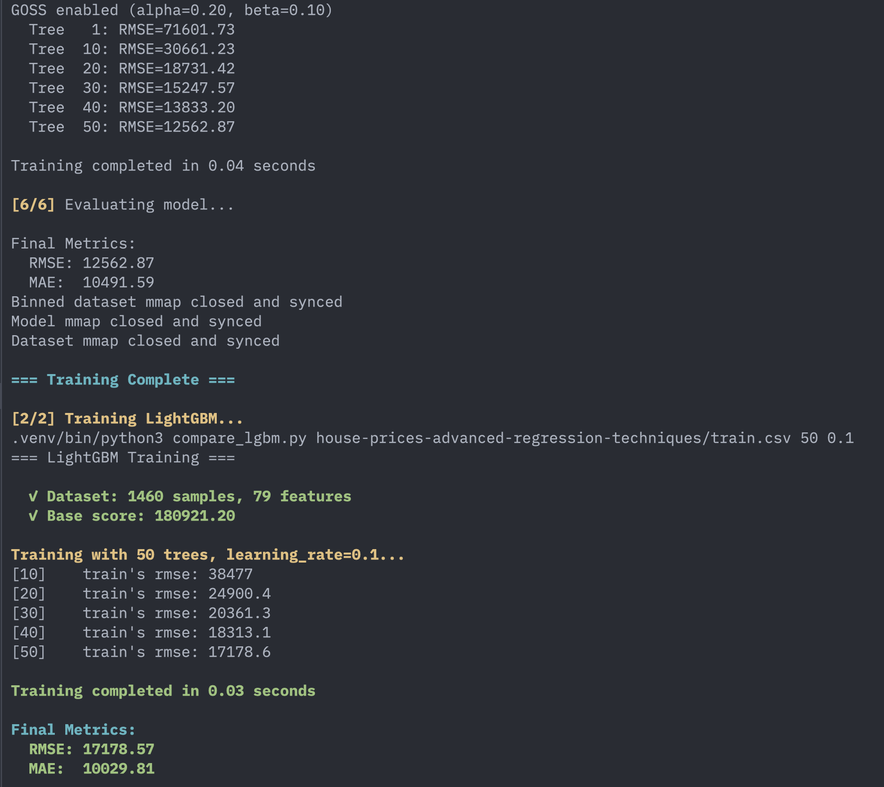

# MinGBM - Minimal Gradient Boosting Machine

A minimal single-threaded GBM implementation in pure C using memory-mapped storage.

Create it to understand how LightGBM works.

Here is a comparison screenshot running MinGBM and LightGBM


## Build

```bash
make
```

## Run

```bash
./build/mingbm <csv_file> [n_trees] [learning_rate]
```

Example:
```bash
./build/mingbm train.csv 50 0.1
```

## Compare with LightGBM

```bash
make compare
```

## Clean

```bash
make clean
```

## Citation

Dataset: [House Prices - Advanced Regression Techniques](https://kaggle.com/competitions/house-prices-advanced-regression-techniques) by Anna Montoya and DataCanary, Kaggle 2016.
